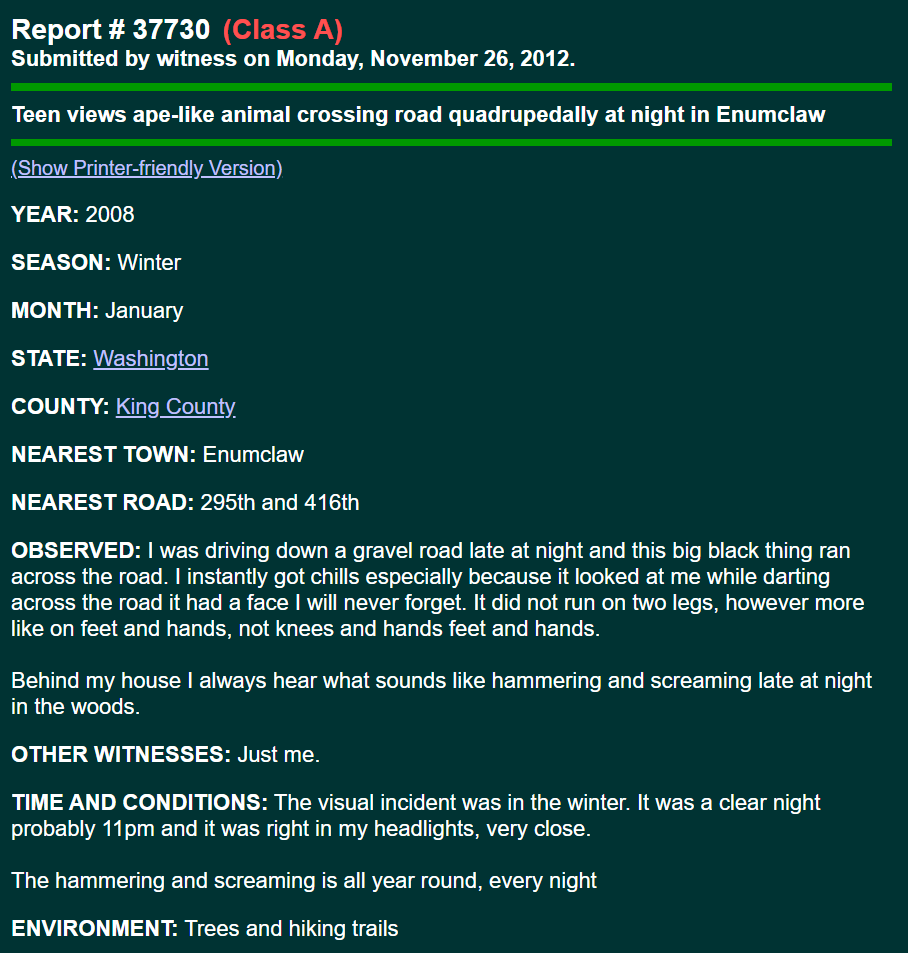
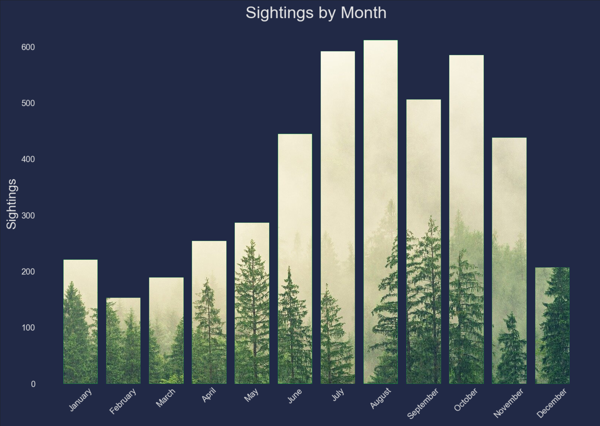
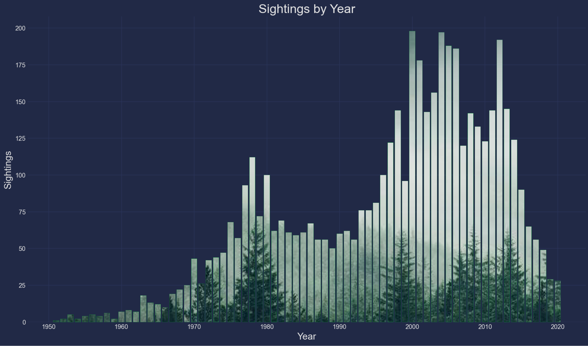
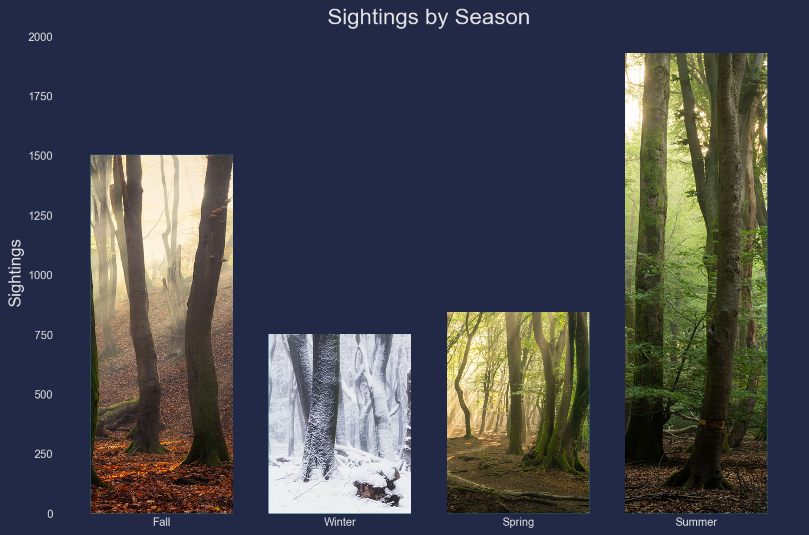
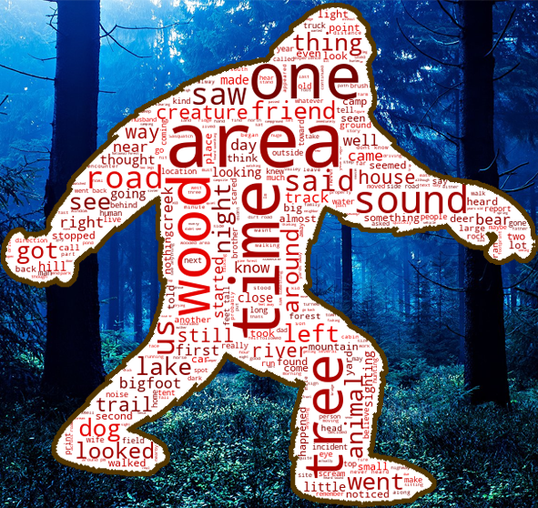

    

This project generates bigfoot sightings using a RNN (recurrent neural network). The sightings are tweeted using a twitter bot which can be accessed here:

https://www.twitter.com/sasBOTch 

 The twitter bot is running on an EC2 instance and is fully automated. Bigfoot sightings used to train the neural network are reported on the website https://www.bfro.net/, the bigfoot field researchers organization. 

## Background

Around 5000 bigfoot sightings have been extracted from www.bfro.net. This project was originally part of the Galvanize data science bootcamp and the scope of the project was a group case study to analyze the web scraped data to do some EDA and report any interesting findings. I wanted to extend the project to create a bigfoot sightings Twitter bot that tweets out sightings generated by a RNN, trained on the web scraped sighting data. The original reports look like:

    
    
Screenshot of sighting from bfro.net.

The pipeline for this project is:

* Check all URLs that have reporting IDs and save valid IDs to a text file

* Web scrape all valid URLs, cleaning the HTML code and save each one to a JSON file

* Take all reports and put them into a bag of words, which will be the training data for the RNN

* Generate new sightings, store them in a JSON file, separate them into sections < 240 characters, and tweet them.

# Data Analysis

The training data, which is around 5000 unique bigfoot sighting reports, were analyzed to see what kind of trends can be found.

Since the sightings were reported having locations, dates, and seasons, first we look at sighting counts grouped by month for all sightings.

    
    
Sighting counts for each month of the year.

Sighting counts over the entire range of the website's reports, grouped by year reflect an increasing trend, partially because the internet hasn't been around at the time of all the sightings, and ones reported from past years are fewer.

    
    
Sighting counts for each year from 1950 to present.

Seasonally, sightings are more frequent in the summer, and less in the winter due to the amount of outdoor activity each season has, as shown below.

  
  
Sighting counts for each month of the year.

## Sighting Content

Looking at all of the sightings, a word cloud of the most frequent words can visually show the common words used to describe bigfoot sightings. A bag of words containing all the sighting text was created, and stop words (words like "the", "and", "or", etc) were filtered out. The word cloud was processed through a filter mask in the shape of bigfoot, and a nighttime forest background was added.

  
  
Sighting counts for each month of the year.

