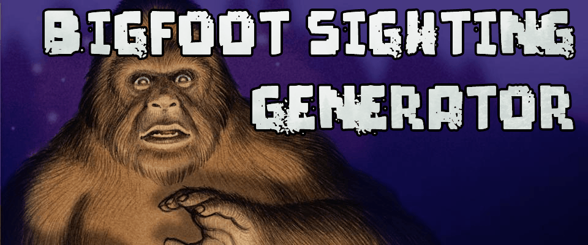
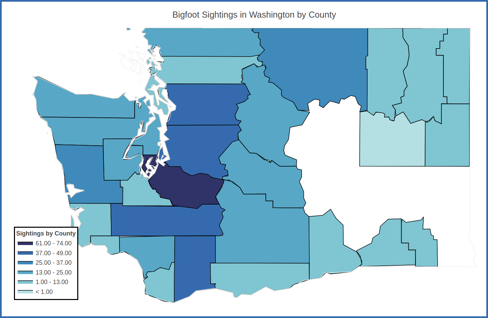
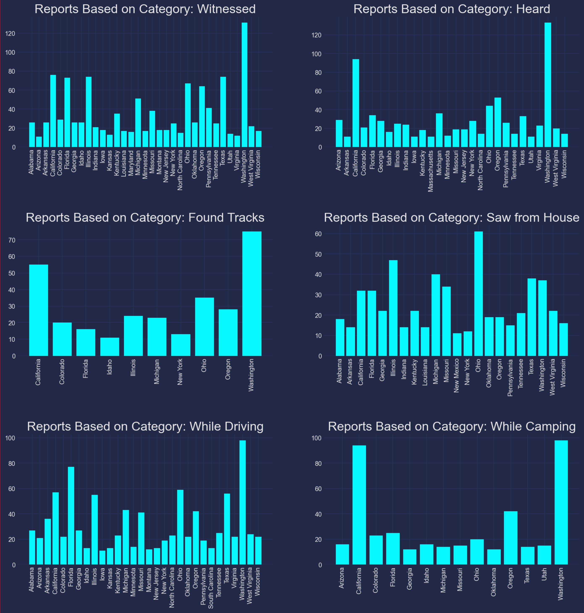

<div align="center">
    

</div>

This project generates bigfoot sightings using GPT-2. The sightings are tweeted using a twitter bot which can be accessed here:

https://www.twitter.com/sasBOTch 

 The twitter bot is running on an EC2 instance and is fully automated. Bigfoot sightings used to train the neural network are reported on the website https://www.bfro.net/, the bigfoot field researchers organization. 

## Background

Around 5000 bigfoot sightings have been extracted from www.bfro.net. This project was originally part of the Galvanize data science bootcamp and the scope of the project was a group case study to analyze the web scraped data to do some EDA and report any interesting findings. I wanted to extend the project to create a bigfoot sightings Twitter bot that tweets out sightings generated by a RNN, trained on the web scraped sighting data. The original reports look like:

<div align="center">
    
    <p>Screenshot of sighting from bfro.net.</p>
</div>

The pipeline for this project is:

* Check all URLs that have reporting IDs and save valid IDs to a text file

* Web scrape all valid URLs, cleaning the HTML code and save each one to a JSON file

* Take all reports and put them into a bag of words, which will be the training data for the RNN

* Generate new sightings, store them in a JSON file, separate them into sections < 240 characters, and tweet them.

# Data Analysis

The training data, which is around 5000 unique bigfoot sighting reports, were analyzed to see what kind of trends can be found.

Since the sightings were reported having locations, dates, and seasons, first we look at sighting counts grouped by month for all sightings.

<div align="center">
    
    <p>Sighting counts for each month of the year.</p>
</div>

Sighting counts over the entire range of the website's reports, grouped by year reflect an increasing trend, partially because the internet hasn't been around at the time of all the sightings, and ones reported from past years are fewer.

<div align="center">
    
    <p>Sighting counts for each year from 1950 to present.</p>
</div>

Seasonally, sightings are more frequent in the summer, and less in the winter due to the amount of outdoor activity each season has, as shown below.

<div align="center">
  
  <p>Sighting counts for each month of the year.</p>
</div>

We can also look at a geographic map of the density of sightings per state using plotly. Washington has the most sightings, which is shown on this map.

<div align="center">
  
  <p>Sighting counts per state.</p>
</div>

Since Washington is my home, and by the sighting counts by state it is most probable that I share my home with bigfoot, zooming in on the state to see sightings by county shows that most sightings are concentrated in King county. This means that bigfoot shares the same country as I do.

<div align="center">
  
  <p>Sighting counts per country for Washington.</p>
</div>

## Sighting Content

Looking at all of the sightings, a word cloud of the most frequent words can visually show the common words used to describe bigfoot sightings. A bag of words containing all the sighting text was created, and stop words (words like "the", "and", "or", etc) were filtered out. The word cloud was processed through a filter mask in the shape of bigfoot, and a nighttime forest background was added.

<div align="center">
  
  <p>Bigfoot shaped word cloud.</p>
</div>

### Feature Extraction

Using K-means clustering and non-negative matrix factorization, the features of the sightings can be extracted and labeled. Typical clustered features look like

> ['heard' 'sound' 'like' 'tent' 'night' 'loud' 'sounded' 'sounds' 'camp'
 'scream']

> ['tracks' 'prints' 'print' 'snow' 'foot' 'inches' 'track' 'trail' 'toes'
 'footprints']

> ['just' 'saw' 'like' 'tree' 'woods' 'looked' 'trail' 'deer' 'got' 'feet']

> ['road' 'saw' 'car' 'driving' 'creature' 'tall' 'just' 'looked' 'hair'
 'like']

> ['creature' 'saw' 'area' 'large' 'river' 'seen' 'like' 'tall' 'feet'
 'bigfoot']

> ['house' 'window' 'door' 'heard' 'dogs' 'outside' 'like' 'dog' 'night'
 'went']

And labels can be inferred based on these vocabulary terms, such as

> ['Heard', 'Tracking' 'Seen', 'Driving', 'Saw', 'House']

Taking the top 10 states for each label, and plotting sighting counts can show how each type of sighting varies from different states.

<div align="center">
  
  <p>Sighting counts for the top states based on type of sighting.</p>
</div>

And stacking them for the top states shows not only which states have the highest number of sightings, but of which type.

<div align="center">
  
  <p>Sighting counts for different features for the top states reporting these types.</p>
</div>

# GPT-2 Transformer Model and RNNs

3 models were trained for this project. A RNN using TensorFlow, a RNN using PyTorch, and a GPT-2 model. They all generated interesting examples which were anywhere from completely illegible to fairly believable.

## RNN Model

The first model for text generation was trained using a RNN with TensorFlow. This model didn't generate believable text, and the sentences generated didn't have much context of the previous sentences. The training data was one large text file with all observations separated by a space. So it would look like:

```
This is observation 1. I saw a creature. It was big. This is observation 2. I was camping. I saw bigfoot! Observation 3...
```

One issue with this is that the model is learning word associations so if the word `hairy` is followed by `creature` a lot of times, there will be a strong association with the word pairings and it will have a higher probability of generating `creature` following the word `hairy`. Here are a few examples of sightings generated using the TensorFlow model:

- `I have a picture of a fighter while first bike up the radio i was in a tent, thinking about 30 ft. high on it towards my vehicle i really saw the creature it was standing higher than my beard. i got a gun and he grabbed his boots in front and connects to the road. i had time to meet the out video and child to fall and met my butt off. as soon as the high 90's i decided to school and realized that it was my rifle at or his best dad looked like, at the time, i instinctively followed it at my sighting.`

And another...

- `Sneak wrap to knock, he's called and mr. did it go? on the way to meet me.when i was another sighting. i was trying to find it and finally fled. after setting when i saw it. i got our no attention to sound like a bear or rotten silence of the source that shook me over and from my stand. he had to pick up a very large creature walk past the south. the trail is quickly straight up as over the tree line, and disappeared. the light from the tank was comming from it as it came over by the water.`

Other issues I noticed when looking at generated text from this model would be sentences like `It was 10am on a summer evening. The moon was out, maybe around midnight and it was a snowy winter day.` Which is understandable since this is text generated from a lot of training data that mentions conditions such as the time of day or the season. So clearly it has no way to understand if it generates `10am` that it should have a higher probability of picking descriptions mentioning `morning` or `day`. 

## GPT-2 Model

Using GPT-2, one nice feature of the model I trained was that instead of training on a large text file with all observations combined, it uses a delimiter so it can learn on sightings as a whole, preserving important relationships between words and sentences. The training data file is structured like:

```
This is observation 1. I saw a creature. It was big. 
  
<|endoftext|> 
   
This is observation 2. I was camping. I saw bigfoot! 

><|endoftext|>

Observation 3...
```

This results in a seemingly more coherent text generation. Here is an example:

- `I was driving down into the campground area at about 6:30 am and I saw a large figures that Mike saw i.. don't know what it was, but he said it ran on two feet a good mile up a steep hill in about 3-5 seconds. He was about 40 yards from it when he did see it and he cant find it on any computer to paste on your web site.`

Not too bad so far. Another example:

- `My parents and I were heading east bound on SRK WAY in Nascahish National Park. I saw what looked like a Sasquatch for myself. It was near dusk. It crossed the road in front of me and went into the trees. It crossed the road in front of me and it was hairy like a person. It was dark brown and had shaggy hair. It went into the trees and I did not see it again.`

These models are difficult to directly compare because there isn't a valid metric to compare them with, other than "Oh that sounds better!". Both main models (The PyTorch model took 4 days to train so I don't plan on trying that one again since the results weren't any better than the TensorFlow model) have lots of hyperparameters that can be tuned during training, and several for sampling. Since training times for both of these models were around 35 hours on the CPU and about 5 hours on the GPU (I am using a GTX 1080 Ti), it is preferable to tune the sampling hyperparameters. 